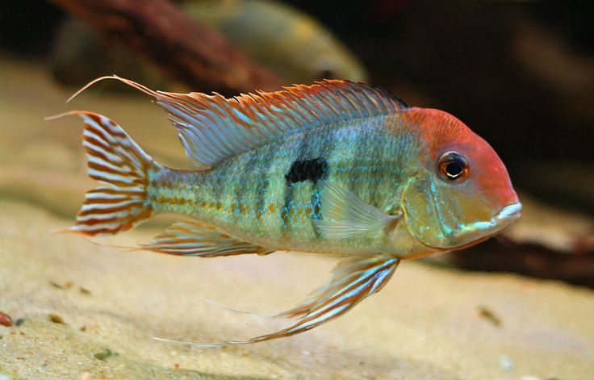

# Using delimtools to delimit Neotropical eartheater cichlids of the genus _Geophagus_

Please install required software following instructions in [install.md](scripts/install.md).

For code to acquire the _Geophagus_ dataset please follow instructions in [acquire-sequence-data.md](scripts/acquire-sequence-data.md).



### R code to run _Geophagus_ delimitation analysis using delimtools

```r
##################
#### packages ####
##################

#renv::install(here::here("assets/delimtools.zip"))
#renv::install(here::here("../delimtools"))
#renv::install("legalLab/delimtools")
# load R packages
# rm(list=ls())
source(here::here("scripts/load-libs.R"))


##################
###### setup #####
##################

# set temporary working directory in 'temp/'
today.dir <- glue::glue('Results_{Sys.Date()}')
today.path <- here::here("temp",today.dir)
if(!dir.exists(today.path)) {dir.create(today.path,recursive=TRUE)}


##################
### load data ####
##################

coi.geophagus.haps.raxml.tr <- ape::read.tree(here::here("assets/coi.geophagus.haps.raxml.nwk"))
coi.geophagus.haps.beast.tr <- treeio::read.beast(here::here("assets/coi.geophagus.haps.beast.tre"))
coi.geophagus.haps.df <- readr::read_csv(here::here("assets/coi.geophagus.haps.csv"),show_col_types=FALSE)
coi.geophagus.haps.fa <- ape::read.FASTA(here::here("assets/coi.geophagus.haps.fasta"))


##################
#### run morph ###
##################

# get delimitations from taxon labels in table
# source(here("../delimtools/R/morph_tbl.R"))
morph.df <- delimtools::morph_tbl(labels=dplyr::pull(coi.geophagus.haps.df,gbAccession),sppVector=dplyr::pull(coi.geophagus.haps.df,scientificName))
morph.df
#morph.df |> print(n=Inf)
morph.df |> delimtools::report_delim()


##################
#### run gmyc ####
##################

# https://species.h-its.org/gmyc/
# check if tree is binary (should be TRUE)
ape::is.binary(treeio::as.phylo(coi.geophagus.haps.beast.tr))
set.seed(42)
gmyc.res <- splits::gmyc(treeio::as.phylo(coi.geophagus.haps.beast.tr),method="single",interval=c(0,5),quiet=FALSE)
summary(gmyc.res)
# make df
gmyc.df <- delimtools::gmyc_tbl(gmyc.res)
#gmyc.df |> print(n=Inf)
gmyc.df |> delimtools::report_delim()
#myc.df <- gmyc.df |> rename(myc=gmyc)

##################
### run bgmyc ###
##################

set.seed(42)
bgmyc.res.single <- bGMYC::bgmyc.singlephy(treeio::as.phylo(coi.geophagus.haps.beast.tr),mcmc=11000,burnin=1000,thinning=100,t1=2,t2=length(treeio::as.phylo(coi.geophagus.haps.beast.tr)$tip.label),start=c(1,0.5,50))
# make df
bgmyc.df <- delimtools::bgmyc_tbl(bgmyc.res.single,ppcutoff=0.05)
#bgmyc.df |> print(n=Inf)
bgmyc.df |> delimtools::report_delim()


##################
### run locmin ###
##################

mat <- ape::dist.dna(coi.geophagus.haps.fa,model="raw",pairwise.deletion=TRUE)
lmin <- spider::localMinima(as.matrix(mat))
plot(lmin); abline(v=lmin$localMinima[1],col="red")
locmin.df <- delimtools::locmin_tbl(mat,threshold=lmin$localMinima[1])
#locmin.df |> print(n=Inf)
locmin.df |> delimtools::report_delim()


##################
##### run 2% #####
##################

locmin.df.pc <- delimtools::locmin_tbl(mat,threshold=0.02) |> dplyr::rename(percent=locmin)
#locmin.df.pc |> print(n=Inf)
locmin.df.pc |> delimtools::report_delim()


##################
#### run asap ####
##################

#source(here("../delimtools/R/asap_tbl.R"))
#asap_tbl(webserver=here::here("temp/Results_2024-09-14/coi.geophagus.haps.fasta.Partition1.csv"))
asap.df <- delimtools::asap_tbl(infile=here::here("assets/coi.geophagus.haps.fasta"),exe=here::here("software/ASAP/bin/asap"),model=3)
#asap.df |> print(n=Inf)
asap.df |> delimtools::report_delim()


##################
#### run abgd ####
##################

#source(here("../delimtools/R/abgd_tbl.R"))
#abgd_tbl(webserver=here::here("temp/Results_2024-09-14/abgd.txt"))
#abgd_tbl(infile=here::here("assets/coi.geophagus.haps.fasta"),slope=0.5,exe=here::here("software/Abgd/bin/abgd"),model=3)
abgd.df <- delimtools::abgd_tbl(infile=here::here("assets/coi.geophagus.haps.fasta"),slope=0.5,exe=here::here("software/Abgd/bin/abgd"),model=3)
#asap.df |> print(n=Inf)
abgd.df |> delimtools::report_delim()


##################
### run mptp s ###
##################

#minbrlen <- format(min(coi.geophagus.raxml.tr.root$edge.length),scientific=FALSE)
#delimtools::minbr(tree=raxml.tr.path, file=here("assets/coi.geophagus.fasta"))
#source(here("../delimtools/R/mptp.R"))
#mptp.s.df <- mptp(infile=here("assets/coi.geophagus.haps.raxml.nwk"),exe=here::here("software/mptp/bin/mptp"),method="single")
# get min branch lengths
#source(here::here("../delimtools/R/mptp_tbl2.R"))
#mptp_tbl2(webserver=here::here("temp/Results_2024-09-14/6qota408p0uedlma3lh4v4deu4.1.txt"))
#mptp_tbl2(webserver=here::here("temp/Results_2024-09-14/pgrqeedkm6gima9lqncibrtcj2.1.txt"))
#source(here::here("../delimtools/R/mptp_tbl2.R"))
#mptp_tbl2(infile=here::here("assets/coi.geophagus.haps.raxml.nwk"),exe=here::here("software/mptp/bin/mptp"),method="single",minbrlen=0.001735)

#source(here::here("../delimtools/R/min_brlen.R"))
delimtools::min_brlen(tree=here::here("assets/coi.geophagus.haps.raxml.nwk"))
mptp.s.df <- delimtools::mptp_tbl(infile=here::here("assets/coi.geophagus.haps.raxml.nwk"),exe=here::here("software/mptp/bin/mptp"),method="single",minbrlen=0.001735)
#mptp.df |> print(n=Inf)
mptp.s.df |> delimtools::report_delim()


##################
### run mptp m ###
##################

#minbrlen <- format(min(coi.geophagus.raxml.tr.root$edge.length),scientific=FALSE)
#delimtools::minbr(tree=raxml.tr.path, file=here("assets/coi.geophagus.fasta"))
#source(here::here("../delimtools/R/mptp.R"))
#source(here::here("../delimtools/R/min_brlen.R"))
mptp.m.df <- delimtools::mptp_tbl(infile=here("assets/coi.geophagus.haps.raxml.nwk"),exe=here::here("software/mptp/bin/mptp"),method="multi",minbrlen=0.001735)
#mptp.df |> print(n=Inf)
mptp.m.df |> delimtools::report_delim()


##################
### join delims ##
##################

all.delims.df <- delimtools::delim_join(list(gmyc.df,bgmyc.df,locmin.df,locmin.df.pc,asap.df,mptp.s.df,mptp.m.df,abgd.df,morph.df))
#all.delims.df <- delimtools::delim_join(list(gmyc.df,myc.df))
#all.delims.df |> print(n=Inf)
all.delims.df |> delimtools::report_delim()

all.delims.df |> delim_consensus(n_match=6)


##################
# subsample data #
##################

# clean and subsample
set.seed(42)
coi.geophagus.haps.df.sub <- coi.geophagus.haps.df |> 
    mutate(scientificName=str_replace_all(scientificName,"_AMX-2021","")) |> 
    mutate(scientificName=str_replace_all(scientificName,"_"," ")) |> 
    slice_sample(n=8,by=scientificName)

# subsample the delims
all.delims.df.sub <- all.delims.df |> filter(labels %in% pull(coi.geophagus.haps.df.sub,gbAccession))

# subample tips
#source(here("../delimtools/R/delim_autoplot2.R"))
coi.geophagus.haps.beast.tr.sub <- coi.geophagus.haps.beast.tr |> tidytree::keep.tip(pull(coi.geophagus.haps.df.sub,gbAccession))


##################
### plot delims ##
##################

# make tip label table
tip.tab <- coi.geophagus.haps.df.sub |> 
    dplyr::mutate(labs=glue::glue("{gbAccession} | {scientificName}")) |> 
    dplyr::select(gbAccession,labs,scientificName)


# get cols
source(here("../delimtools/R/delim_brewer.R"))
#cols <- delim_brewer(delim=all.delims.df.sub, package="viridisLite", palette="viridis", seed=42)
#cols <- delim_brewer(delim=all.delims.df.sub, package="viridisLite", palette="plasma", seed=42)
#cols <- delim_brewer(delim=all.delims.df.sub, package="RColorBrewer", palette="Set1", seed=42)
#cols <- delim_brewer(delim=all.delims.df.sub, package="RColorBrewer", palette="Paired", seed=42)
#cols <- delim_brewer(delim=all.delims.df.sub, package="randomcoloR", seed=42)
cols <- delimtools::delim_brewer(delim=all.delims.df.sub)

# plot and save
#source(here("../delimtools/R/delim_autoplot.R"))
p <- delimtools::delim_autoplot(delim=all.delims.df.sub,tr=coi.geophagus.haps.beast.tr.sub,tbl_labs=tip.tab,col_vec=cols,hexpand=0.3,widths=c(0.4,0.1),n_match=3,delim_order=c("asap","abgd","locmin","percent","gmyc","bgmyc","ptp","mptp","morph"),consensus=TRUE)
ggplot2::ggsave(here::here(today.path,"geophagus-delimitation.pdf"),plot=p,height=500,width=400,units="mm")


# autoplot2
p <- delimtools::delim_autoplot2(delim=all.delims.df.sub, tr=coi.geophagus.haps.beast.tr.sub, consensus=TRUE, n_match= 5, tbl_labs=tip.tab, species="scientificName",hexpand= 0.1, widths= c(0.5, 0.2))
ggplot2::ggsave(here::here(today.path,"geophagus-delimitation.pdf"),plot=p,height=500,width=400,units="mm")


```
