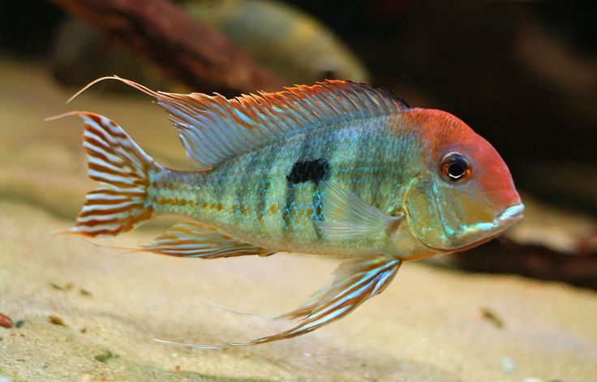

# Using delimtools to delimit Neotropical eartheater cichlids of the genus _Geophagus_

Please install required software following instructions in [install.md](scripts/install.md).

For code to acquire the _Geophagus_ dataset please follow instructions in [acquire-sequence-data.md](scripts/acquire-sequence-data.md).



### R code to run _Geophagus_ delimitation analysis using delimtools

```r
##################
#### packages ####
##################

# load R packages
source(here::here("scripts/load-libs.R"))


##################
###### setup #####
##################

# set temporary working directory in 'temp/'
today.dir <- glue::glue('Results_{Sys.Date()}')
today.path <- here::here("temp",today.dir)
if(!dir.exists(today.path)) {dir.create(today.path,recursive=TRUE)}


##################
### load data ####
##################

# load tree and fasta files
coi.geophagus.haps.raxml.tr <- ape::read.tree(here::here("assets/coi.geophagus.haps.raxml.nwk"))
coi.geophagus.haps.beast.tr <- treeio::read.beast(here::here("assets/coi.geophagus.haps.beast.tre"))
coi.geophagus.haps.df <- readr::read_csv(here::here("assets/coi.geophagus.haps.csv"),show_col_types=FALSE)
coi.geophagus.haps.fa <- ape::read.FASTA(here::here("assets/coi.geophagus.haps.fasta"))


##################
#### run morph ###
##################

# `morph_tbl()` summarises any two vectors of individual labels and species delimitations
# here we use the species names as reported on NCBI
ncbi.df <- delimtools::morph_tbl(labels=dplyr::pull(coi.geophagus.haps.df,gbAccession),sppVector=dplyr::pull(coi.geophagus.haps.df,scientificName),delimname="ncbi")

# print the delimitation table 
ncbi.df |> delimtools::report_delim(tabulate=FALSE)
ncbi.df |> delimtools::report_delim(tabulate=TRUE)


##################
#### run gmyc ####
##################

# General Mixed Yule Coalescent model
# Monaghan et al. (2009); https://doi.org/10.1093/sysbio/syp027
# implemented in the `splits` package

# convert tree to phylo object
coi.geophagus.haps.beast.tr.phy <- treeio::as.phylo(coi.geophagus.haps.beast.tr)

# check if tree is binary (should be TRUE)
ape::is.binary(coi.geophagus.haps.beast.tr.phy)

# run gmyc
set.seed(42)
gmyc.res <- splits::gmyc(coi.geophagus.haps.beast.tr.phy,method="single",interval=c(0,5),quiet=FALSE)
summary(gmyc.res)

# make df
gmyc.df <- delimtools::gmyc_tbl(gmyc.res)
gmyc.df |> delimtools::report_delim(tabulate=FALSE)


#################
### run bgmyc ###
#################

# Bayesian General Mixed Yule Coalescent model
# Reid & Carstens (2012); https://doi.org/10.1186/1471-2148-12-196
# implemented in the `bGMYC` package

# run bgmyc
set.seed(42)
bgmyc.res.single <- bGMYC::bgmyc.singlephy(coi.geophagus.haps.beast.tr.phy,mcmc=11000,burnin=1000,thinning=100,t1=2,t2=length(coi.geophagus.haps.beast.tr.phy$tip.label),start=c(1,0.5,50))

# make df
bgmyc.df <- delimtools::bgmyc_tbl(bgmyc.res.single,ppcutoff=0.05)
bgmyc.df |> delimtools::report_delim(tabulate=FALSE)


##################
### run locmin ###
##################

# localMinima distance threshold method
# Brown et al. (2012; https://doi.org/10.1111/j.1755-0998.2011.03108.x)
# implemented in the `spider` package using genetic distance matrix

# make distance matrix in APE
mat <- ape::dist.dna(coi.geophagus.haps.fa,model="raw",pairwise.deletion=TRUE)
lmin <- spider::localMinima(as.matrix(mat))

# plot to check threshold is sensible
plot(lmin); abline(v=lmin$localMinima[1],col="red")
locmin.df <- delimtools::locmin_tbl(mat,threshold=lmin$localMinima[1])
locmin.df |> delimtools::report_delim(tabulate=FALSE)


###########################
### run locmin treedist ###
###########################

# localMinima distance threshold method
# Brown et al. (2012; https://doi.org/10.1111/j.1755-0998.2011.03108.x)
# implemented in the `spider` package using patristic tree distances

# patristic tree distances
tr.mat <- ape::cophenetic.phylo(coi.geophagus.haps.raxml.tr) |> as.dist()
tr.lmin <- spider::localMinima(tr.mat)

# plot to check threshold is sensible
plot(tr.lmin); abline(v=tr.lmin$localMinima[1],col="red")
treedist.df <- delimtools::locmin_tbl(tr.mat,threshold=tr.lmin$localMinima[1],delimname="treedist")
treedist.df |> delimtools::report_delim(tabulate=FALSE)


##################
##### run 2% #####
##################

# standard DNA barcoding distance threshold cutoff of 2%
# e.g. Ward (2009); https://doi.org/10.1111/j.1755-0998.2009.02541.x
# can be changed to any value

percent.df <- delimtools::locmin_tbl(mat,threshold=0.02,delimname="percent")
percent.df |> delimtools::report_delim(tabulate=FALSE)


##################
#### run asap ####
##################

# ASAP (Assemble Species by Automatic Partitioning_
# Puillandre et al. (2021); https://doi.org/10.1111/1755-0998.13281

# requires path to ASAP executable on your system
file.exists(here::here("software/ASAP/bin/asap"))# should be TRUE
asap.df <- delimtools::asap_tbl(infile=here::here("assets/coi.geophagus.haps.fasta"),exe=here::here("software/ASAP/bin/asap"),model=3)

# or requires path to results produced by the ASAP webserver @ https://bioinfo.mnhn.fr/abi/public/asap/asapweb.html
asap.df <- delimtools::asap_tbl(webserver=here::here("assets/asap.Partition_1.csv"))
asap.df |> delimtools::report_delim(tabulate=FALSE)


##################
#### run abgd ####
##################

# ABGD (Automatic Barcode Gap Discovery)
# Puillandre et al. (2011); https://doi.org/10.1111/j.1365-294X.2011.05239.x

# requires path to ABGD executable on your system
file.exists(here::here("software/Abgd/bin/abgd")) # should be TRUE
abgd.df <- delimtools::abgd_tbl(infile=here::here("assets/coi.geophagus.haps.fasta"),slope=0.5,exe=here::here("software/Abgd/bin/abgd"),model=3)

# or requires path to results produced by the ABGD webserver @ https://bioinfo.mnhn.fr/abi/public/abgd/abgdweb.html
abgd.df <- delimtools::abgd_tbl(webserver=here::here("assets/abgd.groupe1.txt"))
abgd.df |> delimtools::report_delim(tabulate=FALSE)


################
### run mptp ###
################

# requires path to mPTP executable on your system
file.exists(here::here("software/mptp/bin/mptp")) # should be TRUE

# estimate minimum branch lengths (minbrlen) setting
delimtools::min_brlen(tree=here::here("assets/coi.geophagus.haps.raxml.nwk"),n=10)
mptp.df <- delimtools::mptp_tbl(infile=here::here("assets/coi.geophagus.haps.raxml.nwk"),exe=here::here("software/mptp/bin/mptp"),method="single",minbrlen=0.001)

# or requires path to results produced by the mPTP webserver @ https://mptp.h-its.org/#/tree
mptp.df <- delimtools::mptp_tbl(webserver=here::here("assets/mptp.webserver.txt"))
mptp.df |> delimtools::report_delim(tabulate=FALSE)


################
### run pnet ###
################

# statistical parsimony network
# Templeton et al. (1992); https://doi.org/10.1093/genetics/132.2.619
# implemented in `haplotypes` package

pnet <- haplotypes::parsimnet(haplotypes::as.dna(as.matrix(coi.geophagus.haps.fa)),indels="sic",prob=0.95)
pnet.df <- delimtools:::parsimnet_tbl(dna=coi.geophagus.haps.fa, parsimnet=pnet)
pnet.df |> delimtools::report_delim(tabulate=FALSE)


##################
### join delims ##
##################

# combine all delimitation methods into one table
all.delims.df <- delimtools::delim_join(list(ncbi.df,pnet.df,mptp.df,gmyc.df,bgmyc.df,locmin.df,treedist.df,percent.df,asap.df,abgd.df))
all.delims.df |> delimtools::report_delim(tabulate=FALSE)
all.delims.df |> delimtools::report_delim(tabulate=TRUE)

# make consensus 
all.delims.df |> delim_consensus(n_match=5) |> delimtools::report_delim(tabulate=TRUE)

# match ratio congruence
all.delims.df |> delimtools::match_ratio() |> dplyr::arrange(desc(match_ratio)) |> knitr::kable() |> print()


##################
# subsample data #
##################

# clean and subsample
set.seed(42)
coi.geophagus.haps.df.sub <- coi.geophagus.haps.df |> 
    mutate(scientificName=str_replace_all(scientificName,"_AMX-2021","")) |> 
    mutate(scientificName=str_replace_all(scientificName,"_"," ")) |> 
    slice_sample(n=8,by=scientificName)

# subsample the delims
all.delims.df.sub <- all.delims.df |> filter(labels %in% pull(coi.geophagus.haps.df.sub,gbAccession))

# subample tips
#source(here("../delimtools/R/delim_autoplot2.R"))
coi.geophagus.haps.beast.tr.sub <- coi.geophagus.haps.beast.tr |> tidytree::keep.tip(pull(coi.geophagus.haps.df.sub,gbAccession))


##################
### plot delims ##
##################

# make tip label table
tip.tab <- coi.geophagus.haps.df.sub |> 
    dplyr::mutate(labs=glue::glue("{gbAccession} | {scientificName}")) |> 
    dplyr::select(gbAccession,labs,scientificName)

# get cols
cols <- delimtools::delim_brewer(delim=all.delims.df,package="viridisLite",palette="viridis",seed=42)
cols <- delimtools::delim_brewer(delim=all.delims.df,package="viridisLite",palette="plasma",seed=42)
cols <- delimtools::delim_brewer(delim=all.delims.df,package="RColorBrewer",palette="Set2",seed=42)
cols <- delimtools::delim_brewer(delim=all.delims.df,package="randomcoloR",seed=42)
cols <- delimtools::delim_brewer(delim=all.delims.df.sub)

# plot and save
#source(here("../delimtools/R/delim_autoplot.R"))
p <- delimtools::delim_autoplot(delim=all.delims.df.sub,tr=coi.geophagus.haps.beast.tr.sub,tbl_labs=tip.tab,col_vec=cols,hexpand=0.3,widths=c(0.4,0.1),n_match=3,delim_order=c("asap","abgd","locmin","percent","gmyc","bgmyc","mptp","ncbi","parsimnet"),consensus=TRUE)
ggplot2::ggsave(here::here(today.path,"geophagus-delimitation.pdf"),plot=p,height=500,width=400,units="mm")


# autoplot2
p <- delimtools::delim_autoplot2(delim=all.delims.df.sub, tr=coi.geophagus.haps.beast.tr.sub, consensus=TRUE, n_match= 5, tbl_labs=tip.tab, species="scientificName",hexpand= 0.1, widths= c(0.5, 0.2))
ggplot2::ggsave(here::here(today.path,"geophagus-delimitation.pdf"),plot=p,height=500,width=400,units="mm")


```
